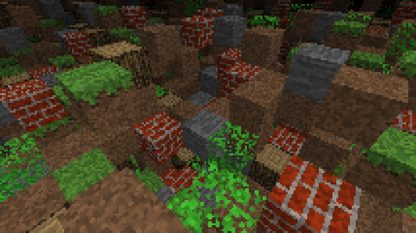

# Minecraft 4k

Minecraft 4k was a game developed for the 2010 Java 4K contest by Notch. More info [here](https://minecraft.fandom.com/wiki/Minecraft_4k).

This repo is a decompilation and a port to C (with SDL2) and runs [on the browser via WebAssembly](https://1sanch0.github.io/Minecraft4k/).

## Teaser

  
